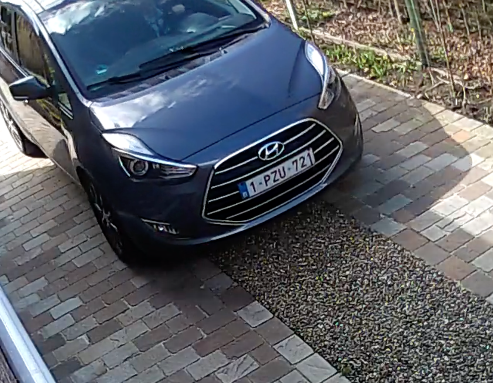
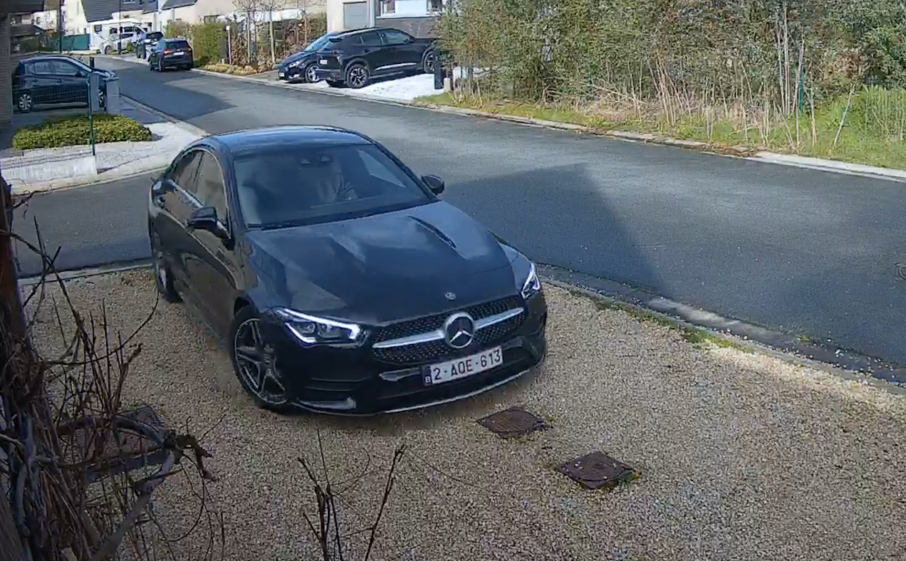

# OpenALPR with Kerberos Vault

This repository was originally created for illustrating the Golang binding delivered by the [Open Source License Plate Recognition project](https://github.com/openalpr/openalpr). Currently there are several open issues ([#831](https://github.com/openalpr/openalpr/issues/831), [#661](https://github.com/openalpr/openalpr/issues/661)) on the GitHub project asking for support, but unfortunately the project looks deprecated.

Within this repository we will be showing how you can build and containerize the OpenALPR Golang binding, and to integrate it with the [Kerberos Vault](https://github.com/kerberos-io/vault) solution. The goal of this project is that you get a good idea of how you can use OpenALPR (or other algorithms such as [YOLOv3, YOLOv7](https://github.com/kerberos-io/hub-objecttracker), etc.) in a production-ready video management deployment.

## Manage OpenALPR dependencies through Docker

As state in the original repostory it is defined in the `Dockerfile` that [several dependencies are required](https://github.com/openalpr/openalpr/blob/master/Dockerfile#L10-L13), and this is exactly where most people are experiencing issues trying to setup their local environment.

To overcome this issues, and avoid people forcing to install dependencies such as:

- `libleptonica-dev`
- `liblog4cplus-dev`
- `libopencv-dev`
- `libtesseract-dev`

We will build and run our project in a Docker container, that will allow us to run it on whatever host system we want, and avoids us installing another load of dependencies which you'll probably never use again.

The [`Dockerfile`](https://github.com/kerberos-io/openalpr/blob/main/Dockerfile) in this project illustrates how to pull a pre-build OpenALPR base image, install the Go toolchain, import the source code from our repository, build it and provide the `main.go` as the `ENTRYPOINT` of the Docker container.

## Base image

The [`Dockerfile`](https://github.com/kerberos-io/openalpr/blob/main/Dockerfile) in this project inherits from the `kerberos/openalpr-base:latest` base image. This image is a build on top of a customised [OpenALPR Dockerfile](https://github.com/kerberos-io/openalpr-base/blob/master/Dockerfile), which you can find [in our forked GitHub repository](https://github.com/kerberos-io/openalpr-base). This `Dockerfile` includes the latest OpenCV version, compiled through [ybridgroup/gocv](https://github.com/hybridgroup/gocv).

## How to run?

By building the `Dockerfile`, your Go code will be copied into the Docker image, and build to an executable.

    docker build -t kerberos/openalpr .

The output of this command is a `Docker` container with an `ENTRYPOINT` to your Go project (`main.go`). By executing `docker run` you can execute your source code.

    docker run -it kerberos/openalpr

## Test

Assuming you have build this repository to a Docker image, you can execute following command.

    openalpr % docker run -v $PWD:/tmp -it kerberos/openalpr

If you made no changes to the `main.go` file in this repository, we will try to locate and read the license plate, of the car shown in `car6.png`.

The results outputted by our Go program will look like this.

    Invalid detector specified: lbpcpu # lbpgpu.  Using default
    {EpochTime:1681385110752 ImgWidth:0 ImgHeight:775 TotalProcessingTimeMs:192.30296 Plates:[{RequestedTopN:20 BestPlate:H2A0E613 TopNPlates:[{Characters:H2A0E613 OverallConfidence:87.09134 MatchesTemplate:false} {Characters:2A0E613 OverallConfidence:84.433914 MatchesTemplate:false} {Characters:H20E613 OverallConfidence:84.93612 MatchesTemplate:false} {Characters:20E613 OverallConfidence:85.7055 MatchesTemplate:false} {Characters:H260E613 OverallConfidence:81.33587 MatchesTemplate:false} {Characters:260E613 OverallConfidence:81.06131 MatchesTemplate:false} {Characters:H2QE613 OverallConfidence:80.45219 MatchesTemplate:false} {Characters:M2A0E613 OverallConfidence:84.42236 MatchesTemplate:false} {Characters:H2AQE613 OverallConfidence:84.13573 MatchesTemplate:false} {Characters:240E613 OverallConfidence:81.065765 MatchesTemplate:false} {Characters:2AQE613 OverallConfidence:81.47829 MatchesTemplate:false} {Characters:M2AQE613 OverallConfidence:81.46675 MatchesTemplate:false} {Characters:H240E613 OverallConfidence:80.29639 MatchesTemplate:false} {Characters:H2AOE613 OverallConfidence:80.99691 MatchesTemplate:false} {Characters:M20E613 OverallConfidence:80.738815 MatchesTemplate:false} {Characters:20ES13 OverallConfidence:78.53983 MatchesTemplate:false} {Characters:H2ADE613 OverallConfidence:80.655045 MatchesTemplate:false} {Characters:20EG13 OverallConfidence:78.46774 MatchesTemplate:false} {Characters:2QE613 OverallConfidence:78.23132 MatchesTemplate:false} {Characters:H2A0ES13 OverallConfidence:79.67437 MatchesTemplate:false}] ProcessingTimeMs:13.879541 PlatePoints:[{X:812 Y:436} {X:949 Y:445} {X:948 Y:474} {X:812 Y:465}] PlateIndex:0 RegionConfidence:0 Region:}] RegionsOfInterest:[{X:0 Y:0 Width:1314 Height:775}]}
    License Plate: H2A0E613

With following output image, containing a bounding box for the located license plate and license plate number.

## Few more tests

    {EpochTime:1681386039669 ImgWidth:0 ImgHeight:908 TotalProcessingTimeMs:68.74504 Plates:[{RequestedTopN:20 BestPlate:JEI23 TopNPlates:[{Characters:JEI23 OverallConfidence:77.39305 MatchesTemplate:false} {Characters:IJE72 OverallConfidence:77.11269 MatchesTemplate:false} {Characters:JEI23J OverallConfidence:76.524994 MatchesTemplate:false} {Characters:TJE72 OverallConfidence:76.21358 MatchesTemplate:false} {Characters:JE23J OverallConfidence:75.58059 MatchesTemplate:false}] ProcessingTimeMs:10.295 PlatePoints:[{X:468 Y:602} {X:633 Y:601} {X:634 Y:637} {X:469 Y:639}] PlateIndex:0 RegionConfidence:0 Region:}] RegionsOfInterest:[{X:0 Y:0 Width:1060 Height:908}]}
    License Plate: JEI23

    Failed to find license plate (I assume to much in perspective).

    {EpochTime:1681386430566 ImgWidth:0 ImgHeight:451 TotalProcessingTimeMs:54.099583 Plates:[{RequestedTopN:20 BestPlate:7O4956O1 TopNPlates:[{Characters:7O4956O1 OverallConfidence:94.35298 MatchesTemplate:false} {Characters:7O495601 OverallConfidence:92.170296 MatchesTemplate:false} {Characters:704956O1 OverallConfidence:91.98635 MatchesTemplate:false} {Characters:7O495GO1 OverallConfidence:91.105385 MatchesTemplate:false} {Characters:7O4956Q1 OverallConfidence:89.20698 MatchesTemplate:false} {Characters:7O4956D1 OverallConfidence:89.06156 MatchesTemplate:false} {Characters:7Q4956O1 OverallConfidence:89.1066 MatchesTemplate:false} {Characters:7D4956O1 OverallConfidence:89.08189 MatchesTemplate:false} {Characters:7O495SO1 OverallConfidence:87.61931 MatchesTemplate:false} {Characters:7O495BO1 OverallConfidence:86.968185 MatchesTemplate:false} {Characters:7O4956G1 OverallConfidence:87.320145 MatchesTemplate:false} {Characters:7G4956O1 OverallConfidence:86.15845 MatchesTemplate:false} {Characters:7O495G01 OverallConfidence:85.182625 MatchesTemplate:false} {Characters:70495GO1 OverallConfidence:84.99867 MatchesTemplate:false} {Characters:70495601 OverallConfidence:89.80367 MatchesTemplate:false} {Characters:7Q495601 OverallConfidence:86.92391 MatchesTemplate:false} {Characters:7D495601 OverallConfidence:86.899216 MatchesTemplate:false} {Characters:7O4S56O1 OverallConfidence:85.90428 MatchesTemplate:false} {Characters:704956Q1 OverallConfidence:86.84035 MatchesTemplate:false} {Characters:704956D1 OverallConfidence:86.69493 MatchesTemplate:false}] ProcessingTimeMs:16.126793 PlatePoints:[{X:250 Y:286} {X:408 Y:288} {X:408 Y:323} {X:250 Y:322}] PlateIndex:0 RegionConfidence:0 Region:}] RegionsOfInterest:[{X:0 Y:0 Width:667 Height:451}]}
    License Plate: 7O4956O1

    Failed to find license plate (I assume to much in perspective).

    {EpochTime:1681385904285 ImgWidth:0 ImgHeight:556 TotalProcessingTimeMs:73.58679 Plates:[{RequestedTopN:20 BestPlate:MUIEPSD TopNPlates:[{Characters:MUIEPSD OverallConfidence:87.56559 MatchesTemplate:false} {Characters:MU1EPSD OverallConfidence:82.02317 MatchesTemplate:false} {Characters:HUIEPSD OverallConfidence:81.670334 MatchesTemplate:false} {Characters:UIEPSD OverallConfidence:81.58141 MatchesTemplate:false} {Characters:NUIEPSD OverallConfidence:81.211 MatchesTemplate:false} {Characters:MUIEPS0 OverallConfidence:79.05276 MatchesTemplate:false} {Characters:M0IEPSD OverallConfidence:78.636 MatchesTemplate:false} {Characters:MUIEP5D OverallConfidence:77.83172 MatchesTemplate:false} {Characters:BMUIEPSD OverallConfidence:86.12214 MatchesTemplate:false} {Characters:GMUIEPSD OverallConfidence:85.21181 MatchesTemplate:false} {Characters:MUEPSD OverallConfidence:81.449135 MatchesTemplate:false} {Characters:BHUIEPSD OverallConfidence:80.22688 MatchesTemplate:false} {Characters:BMU1EPSD OverallConfidence:79.378654 MatchesTemplate:false} {Characters:GHUIEPSD OverallConfidence:79.31654 MatchesTemplate:false} {Characters:MDIEPSD OverallConfidence:77.55929 MatchesTemplate:false} {Characters:BNUIEPSD OverallConfidence:79.21253 MatchesTemplate:false} {Characters:MUIEPSQ OverallConfidence:76.94683 MatchesTemplate:false} {Characters:MUIEPSO OverallConfidence:76.89011 MatchesTemplate:false} {Characters:GMU1EPSD OverallConfidence:78.468315 MatchesTemplate:false} {Characters:MUIEFSD OverallConfidence:76.67001 MatchesTemplate:false}] ProcessingTimeMs:14.716875 PlatePoints:[{X:512 Y:319} {X:591 Y:319} {X:591 Y:338} {X:512 Y:338}] PlateIndex:0 RegionConfidence:0 Region:}] RegionsOfInterest:[{X:0 Y:0 Width:990 Height:556}]}
    License Plate: MUIEPSD
